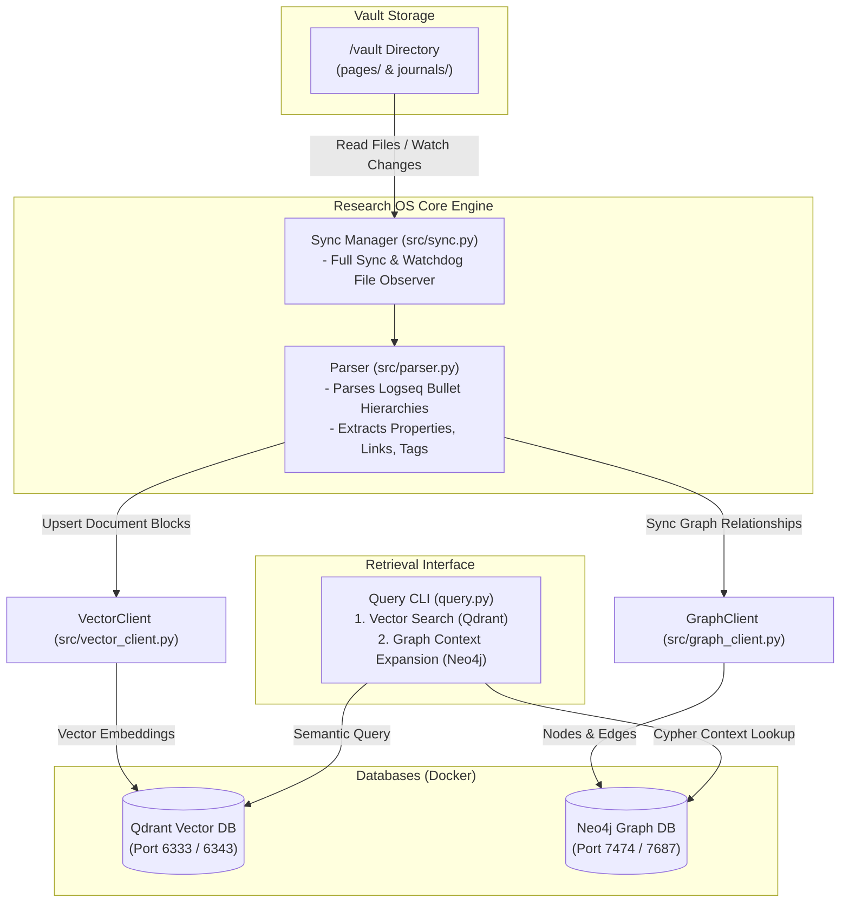

```markdown
# Research OS

**Research OS** is a hybrid knowledge substrate and retrieval system designed to index, search, and semantically expand structured personal knowledge bases (such as Logseq vaults)[cite: 1, 2, 6]. By combining dense vector embeddings for semantic retrieval with a graph database for contextual and structural traversal, Research OS bridges the gap between neural text similarity and graph-based knowledge networks[cite: 2, 4, 7].

---

## Overview

### What It Does
Research OS parses Markdown knowledge vaults containing bullet-point hierarchies[cite: 5, 6], extracts inline properties (`key:: value`), wiki links (`[[link]]`), and hashtags (`#tag`)[cite: 5], and indexes these elements concurrently across two database systems[cite: 4, 6, 7]:
1. **Qdrant**: Stores vector embeddings of block content to support semantic search[cite: 7].
2. **Neo4j**: Stores block structure, block-to-block hierarchies, page ownership, wiki-link edges, and hashtag associations[cite: 4].

When queried, the system performs a hybrid search[cite: 2]: it first finds top-matching blocks via vector similarity, then expands the graph context in Neo4j to retrieve connected concepts and tags[cite: 2].

### Key Technical Characteristics
- **Hybrid Retrieval Strategy**: Integrates dense vector embeddings (`all-MiniLM-L6-v2`) with Neo4j Cypher pattern matching[cite: 2, 7].
- **Hierarchical Bullet-Block Parsing**: Handles Logseq-style bullet indentation levels, mapping block parent-child relationships[cite: 5].
- **Real-Time Workspace Synchronization**: Supports both batch synchronization and real-time filesystem monitoring via `watchdog`[cite: 6].
- **Containerized Data Infrastructure**: Pre-configured using Docker Compose for simple local deployment[cite: 1].

---

## Features

- **Logseq-Compatible Parsing**: Extracts Markdown headers, indented bullet points, inline properties, `[[Wiki Links]]`, and `#tags`[cite: 5].
- **Dual Indexing Engine**:
  - Vectorizes text blocks into 384-dimensional embeddings stored in Qdrant[cite: 7].
  - Construct graph structures (Pages, Blocks, Tags, Links) with Neo4j[cite: 4].
- **Incremental & Workspace Sync**: Synchronizes entire vaults or monitors file modification events in real time[cite: 6].
- **Hybrid Query Pipeline**: Combines semantic similarity scores with graph-traversal context expansion in a unified CLI[cite: 2].

---

## Architecture

Research OS reads Markdown files from a target directory (`./vault`)[cite: 6], parses blocks and structural metadata[cite: 5], and populates both Neo4j and Qdrant[cite: 4, 7]. Queries traverse the vector index first and then expand related graph context[cite: 2].



---

## Technology Stack

| Technology | Purpose |
| --- | --- |
| **Python** | Core application language

 |
| **Neo4j** | Graph database for page, block hierarchy, wiki links, and tag networks

 |
| **Qdrant** | Vector database for storing and searching dense vector embeddings

 |
| **SentenceTransformers** | Embedding generation model (`all-MiniLM-L6-v2`)

 |
| **Watchdog** | File system monitoring service for real-time vault synchronization

 |
| **Docker Compose** | Orchestration of Neo4j and Qdrant containerized infrastructure

 |
| **HTTPX** | HTTP client for vector REST API operations

 |
| **TQDM** | Progress bar display during workspace indexing

 |

---

## Project Structure

```text
Research-OS-v0.1/
├── src/
│   ├── __init__.py
│   ├── graph_client.py     # Neo4j graph operations and Cypher queries
│   ├── parser.py           # Logseq markdown bullet/block hierarchy parser
│   ├── sync.py             # Full vault indexing and watchdog file monitoring
│   └── vector_client.py   # Qdrant client integration and embedding generation
├── vault/
│   ├── journals/           # Logseq journal entry storage
│   └── pages/              # Logseq note pages storage
├── docker-compose.yml      # Service orchestration for Neo4j and Qdrant
├── query.py                # CLI query execution interface
└── requirements.txt        # Python package dependencies
```[cite: 1]

---

## Requirements

- **Python**: `^3.8` (Recommended Python 3.10+)[cite: 1]
- **Docker & Docker Compose**: For hosting Neo4j and Qdrant instances[cite: 1]
- **Hardware/Memory**: Standard CPU (SentenceTransformer model runs locally)[cite: 7]

---

## Installation

1. **Clone the Repository**:
   ```bash
   git clone <repository-url>
   cd Research-OS-v0.1
   ```[cite: 1]

2. **Set Up a Virtual Environment**:
   ```bash
   python -m venv .venv
   source .venv/bin/activate  # On Windows use: .venv\Scripts\activate

```

3. **Install Dependencies**:
```bash
pip install -r requirements.txt
```[cite: 3]


```


4. **Start Database Containers**:
```bash
docker-compose up -d
```[cite: 1]


```


---

## Configuration

Database credentials and service ports are configured by default in `docker-compose.yml` and client initializations:

| Environment Variable / Config | Default Value | Purpose |
| --- | --- | --- |
| `NEO4J_AUTH` | `neo4j/researchospassword` | Neo4j database authentication credentials

 |
| `Neo4j Bolt URI` | `bolt://localhost:7687` | Connection string for Neo4j Bolt protocol

 |
| `Neo4j HTTP Port` | `7474` | Neo4j Web Console / HTTP API port

 |
| `Qdrant HTTP Port` | `6333` | Qdrant REST API port

 |
| `Qdrant gRPC Port` | `6343` | Qdrant gRPC API port

 |
| `Vector Model` | `all-MiniLM-L6-v2` | SentenceTransformer model used for embeddings

 |

---

## Running the Project

### 1. Synchronize Knowledge Base

Before querying, populate the databases with your vault contents. Place markdown notes in `./vault/pages/` or `./vault/journals/`.

* **Run a One-Time Workspace Indexing**:
```bash
python -m src.sync full
```[cite: 6]


```


* **Start Real-Time Vault Monitoring**:
```bash
python -m src.sync watch
```[cite: 6]


```


### 2. Querying the Knowledge Base

Execute queries via the CLI:

```bash
python query.py "your search phrase here"
```[cite: 2]

If no argument is passed, `query.py` defaults to running a sample test query[cite: 2].

---

## How It Works

1. **Vault Ingestion**: `src/parser.py` reads Markdown files[cite: 5, 6]. It builds hierarchical `Block` objects based on indentation levels and extracts links (`[[...]]`), tags (`#tag`), and key-value properties (`key:: value`)[cite: 5].
2. **Graph Indexing**: `src/graph_client.py` writes nodes (`Page`, `Block`, `Tag`) and relationships (`HAS_ROOT_BLOCK`, `CHILD_OF`, `LINKS_TO`, `HAS_TAG`) into Neo4j[cite: 4].
3. **Vector Indexing**: `src/vector_client.py` computes dense embeddings for every non-empty block using `SentenceTransformer('all-MiniLM-L6-v2')` and stores them in Qdrant along with payload metadata[cite: 7].
4. **Hybrid Search Execution**:
   - `query.py` queries Qdrant to retrieve top matching text blocks based on cosine similarity[cite: 2, 7].
   - It takes the primary matched page context and executes a Neo4j Cypher query to retrieve associated `[[Wiki Links]]` and `#tags` tied to those blocks[cite: 2].

---

## Core Components

- **`src/parser.py`**: Handles parsing of markdown files, maintaining parent-child relationships across nested list structures, and extracting block-level attributes[cite: 5].
- **`src/graph_client.py`**: Manages the Neo4j connection pool, sets up uniqueness constraints on block and page IDs, and handles batch database operations[cite: 4].
- **`src/vector_client.py`**: Manages Qdrant vector collections, formats payloads, converts string IDs to 64-bit integer hashes, and performs vector queries via HTTP[cite: 7].
- **`src/sync.py`**: CLI handler that coordinates file traversal across vault directories and manages file watcher events using `watchdog`[cite: 6].
- **`query.py`**: Interface for combined semantic search and graph context retrieval[cite: 2].

---

## Database Schema & Graph Model

### Neo4j Graph Model
- **Node Labels**:
  - `:Page {name: STRING}`[cite: 4]
  - `:Block {id: STRING, text: STRING, page: STRING, properties: JSON_STRING}`[cite: 4]
  - `:Tag {name: STRING}`[cite: 4]
- **Relationships**:
  - `(:Page)-[:HAS_ROOT_BLOCK]->(:Block)`[cite: 4]
  - `(:Block)-[:CHILD_OF]->(:Block)`[cite: 4]
  - `(:Block)-[:LINKS_TO]->(:Page)`[cite: 4]
  - `(:Block)-[:HAS_TAG]->(:Tag)`[cite: 4]

### Qdrant Vector Payload
- **Collection Name**: `research_blocks`[cite: 7]
- **Vector Dimension**: `384` (Distance Metric: Cosine)[cite: 7]
- **Payload Schema**:
  ```json
  {
    "block_id": "string",
    "page_name": "string",
    "text": "string",
    "properties": {}
  }
  ```[cite: 7]

---

## Docker Configuration

The application relies on Docker Compose to manage persistent database services[cite: 1]:

```yaml
version: '3.8'

services:
  neo4j:
    image: neo4j:5.12.0-community
    container_name: researchos_graph
    ports:
      - "7474:7474"
      - "7687:7687"
    environment:
      - NEO4J_AUTH=neo4j/researchospassword
    volumes:
      - neo4j_data:/data

  qdrant:
    image: qdrant/qdrant:v1.7.0
    container_name: researchos_vector
    ports:
      - "6333:6333"
      - "6343:6343"
    volumes:
      - qdrant_data:/qdrant/storage

volumes:
  neo4j_data:
  qdrant_data:
```[cite: 1]

To reset container state and clear stored database data:
```bash
docker-compose down -v
docker-compose up -d
```[cite: 1]

---

## Security Considerations

- **Default Credentials**: Default credentials (`neo4j/researchospassword`) are hardcoded in `docker-compose.yml`, `graph_client.py`, and `query.py`[cite: 1, 4, 2]. Override these defaults before deploying to external or production environments[cite: 1, 4, 2].
- **Network Interfaces**: Ensure Neo4j (`7474`, `7687`) and Qdrant (`6333`, `6343`) ports are bound to `127.0.0.1` or restricted behind a firewall if deployed on a shared network[cite: 1].

---

## Troubleshooting

- **Database Connection Failure**:
  - Verify that Docker containers are running using `docker ps`[cite: 1].
  - Check container status: `docker-compose logs neo4j` or `docker-compose logs qdrant`[cite: 1].
- **No Documents Detected During Sync**:
  - Ensure Markdown files are placed inside `./vault/pages/` or `./vault/journals/`[cite: 6].
- **Missing Graph Insights on Query**:
  - Ensure a full synchronization (`python -m src.sync full`) has been completed after adding new files[cite: 6].

---

## License

*License*

```